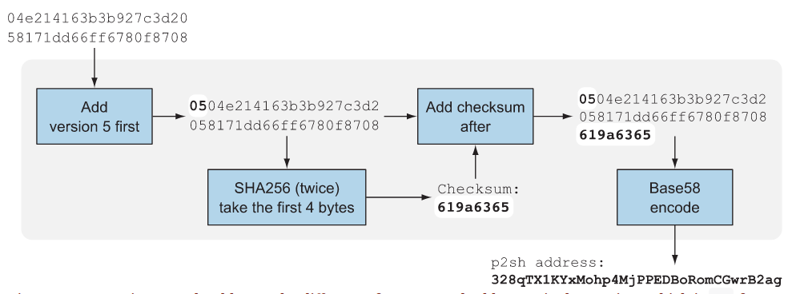

## p2sh txn

>> It hides the `script program`. Instead of giving a big, complicated pubkey script to the sender, you give them just the hash of the script. The sender then makes a payment to that hash and leaves it up to the recipient to provide the script later, when the recipient wants to spend the money.

> The new software looks at the pubkey script to determine if this transaction is spending a p2sh output

> **Pattern**
>   - OP_HASH160
>   - 20 byte hash
>   - OP_EQUAL

First, it will perform the same seven steps of verfication, but it will save the stack. Let’s call this the saved stack. If the first seven steps result in OK, then the stack is replaced by the saved stack; and the top item, redeemScript, is taken off the stack. 
**must create a p2sh output instead of a normal p2pkh.**

This process is almost the same as for p2pkh addresses. The only difference is that the version is `05` instead of `00`. This will cause the address to begin with a `3` instead of a `1`.

Because of this change and how base58 works—using integer division by 58 successively—the last remainder will always be 2

#### `p2sh addresses to start with a 3` base58check-decode the address and create a proper p2sh output

**`Version`**

    Each transaction has a version. As of this writing, there are two versions: 1 and 2.
    
**`Sequence number`**

    A 4-byte number on each input. For most transactions, this is set to its maximum value ffffffff. This is an old, disabled feature that’s being repurposed for new functionality.

**`Lock time`**

    A point in time before which the transaction can’t be added to the spreadsheet. If the lock time is 0, the transaction is always allowed to be added to the spreadsheet.

