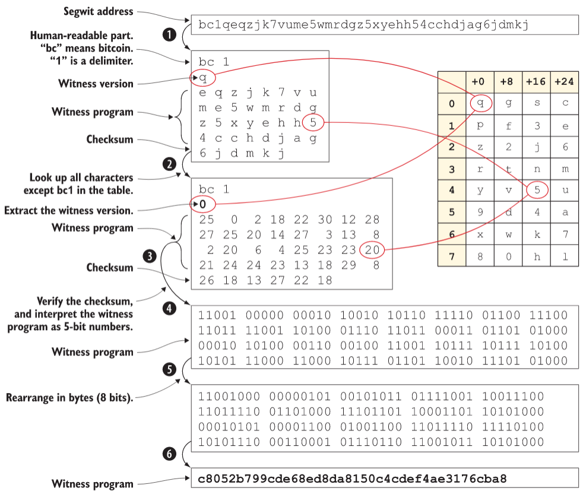
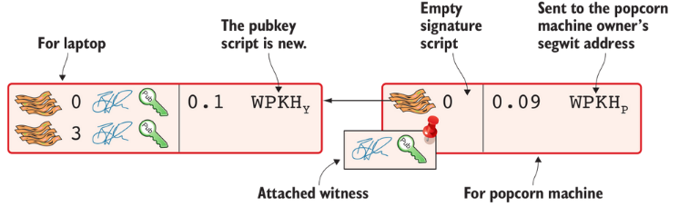
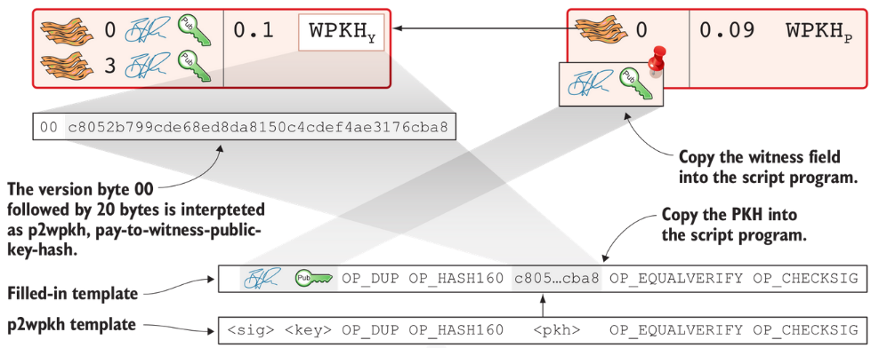
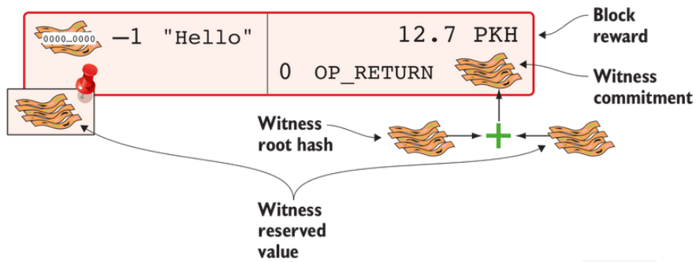

## p2wpkh txn

>> `Segwit address` consists of two parts. The **first two characters**, `bc` (short for bitcoin) is the human-readable part. The `1` is a **delimiter** between the human-readable part and the data part.

### Extraction

> This occurs in multiple steps:
> * The human-readable part and the data part are separated.
> * The data part of the address is converted, character by character, into numbers using a base32 lookup table. The first of these numbers is the witness version, 0. The following numbers, except the last six, are the witness program. The last six numbers are the checksum.
> * The checksum is verified; no errors were detected in this example.
> * The witness program is rewritten by writing each number as a `5-bit number`.
> * The bits are rearranged in groups of `8 bits`. Each such group represents a byte of the witness program.
> * Amy extracts the witness program as `c8052b7…3176cba8`

> The input has an empty signature script; the signature data is instead added as a witness field in the attached witness.

> If there are `multiple inputs` in this transaction, there would be `multiple witness` fields in the witness, one for each input. You can mix segwit inputs and legacy inputs, in which case the witness fields for the legacy inputs would be empty because their signatures are in the respective signature script, as they always were.

### Verification

> 1. look for a pattern in the pubkey script starting with a single version byte followed by a 2- to 40-byte witness program
> 2. what kind of segwit output it is
>    * Pay-to-witness-public-key-hash (p2wpkh), identified by a 20-byte witness program, as in this example
>    * Pay-to-witness-script-hash (p2wsh), identified by a 32-byte witness program. p2wsh will be explained later in this chapter.
> 3. It’s seemingly the exact same program that is run for both of these two types. The difference is where the components come from.

### Including your segwit transaction in a block

> If there are `segwit transactions` in the block, the coinbase transaction must contain an output with a `witness commitment`. This witness commitment is the combined hash of the witness root hash and a witness reserved value. The witness root hash is the merkle root of the witness txids (wtxids) of all transactions in the block. The wtxid is the hash of the transaction including the witness, if there is one. An exception exists for the coinbase, whose wtxid is always defined as 32 zero bytes. The witness reserved value is dedicated for future system upgrades.

> The witness reserved value can be any value. But a full node verifying this block needs a way to know what that value is. If the node didn’t know the witness reserved value, it wouldn’t be able to reconstruct the witness commitment for comparison with the OP_RETURN output’s witness commitment. The coinbase transaction’s witness contains the witness reserved value so full nodes can verify the witness commitment.
